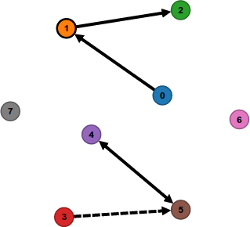

##D3.js GraphEditor

This is a D3.js Graph Editor which was extended from http://bl.ocks.org/rkirsling/5001347 
and might be a bit more structured.

<p align="center">
  
</p>

##Getting Started

```javascript

var nodes = [
	{id: 0},
	{id: 1},
	{id: 2}
];

var links = [
	{source: nodes[0], target: nodes[1], left: false, right: true },
	{source: nodes[1], target: nodes[2], left: false, right: true }
];

var editor = new GraphEditor(
	"#graphEditor",
	{nodes : nodes, links : links, lastNodeID : 2}
);

```